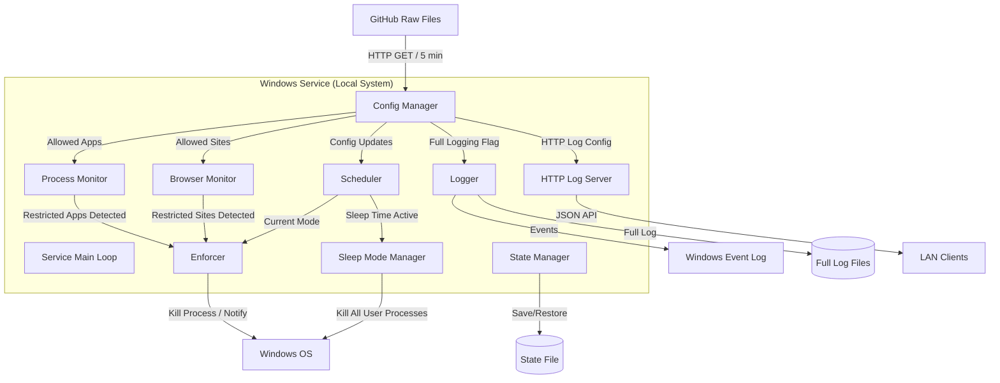
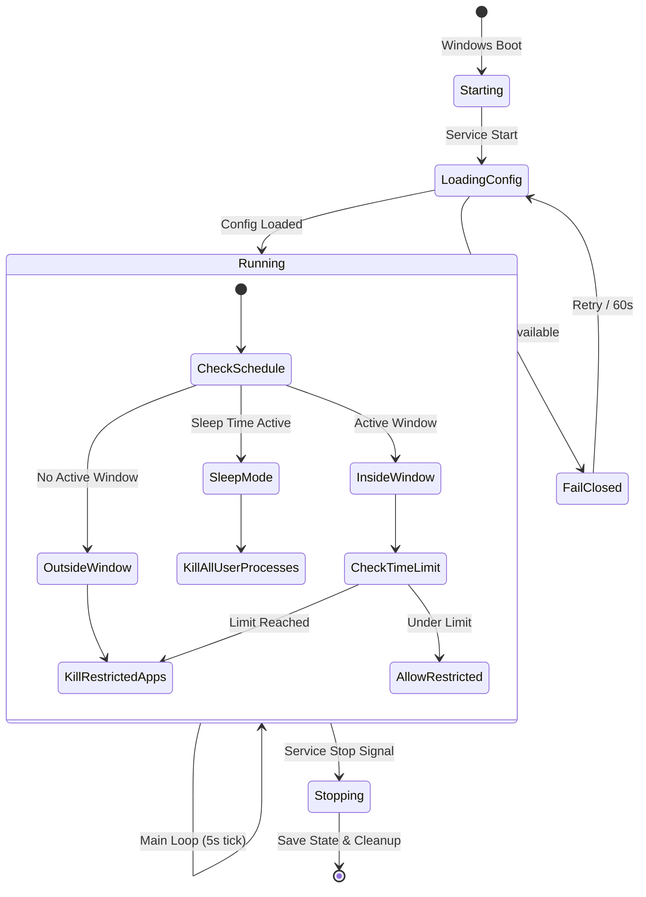
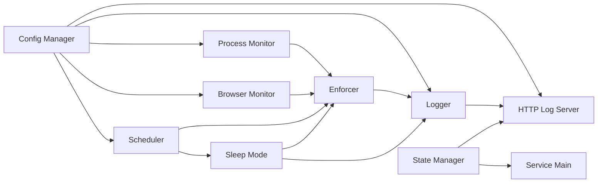

# Проектный документ: Сервис родительского контроля

## Обзор

Сервис родительского контроля — Windows-служба на Go, работающая под учётной записью Local System. Сервис отслеживает запущенные процессы и активность в браузерах, ведёт учёт развлекательного времени по wall clock, применяет расписание доступа и блокирует неразрешённые программы/сайты. Конфигурация загружается с GitHub каждые 5 минут. Состояние сохраняется на диск для устойчивости к перезагрузкам.

Ключевые проектные решения:
- Подсчёт развлекательного времени по wall clock (не суммарно по приложениям) — если запущено 3 неразрешённых программы одновременно, считается одно непрерывное время
- Время сна имеет абсолютный приоритет над временными окнами
- При недоступности конфигурации — блокировка всего кроме системных процессов (fail-closed)
- Мониторинг браузеров через UI Automation API для получения URL из адресной строки

## Архитектура

### Общая архитектура



### Цикл работы сервиса



### Принцип работы основного цикла

Основной цикл сервиса выполняется каждые 5 секунд:

1. **Проверка расписания** — определить текущий режим (Время сна / Вне окна / Внутри окна)
2. **Сканирование процессов** — получить список запущенных пользовательских процессов
3. **Классификация процессов** — системный / разрешённый / неразрешённый
4. **Мониторинг браузеров** — получить активные URL из Chrome, Edge, Firefox
5. **Обновление счётчика** — если есть неразрешённая активность, увеличить счётчик на elapsed time
6. **Применение правил** — завершить процессы / показать уведомления по текущему режиму
7. **Сохранение состояния** — каждые 30 секунд записать состояние на диск


## Компоненты и интерфейсы

### 1. Service Main (`cmd/service/`)

Точка входа Windows-службы. Минимальный код: регистрация службы, инициализация компонентов, запуск основного цикла.

```go
// cmd/service/main.go
func main() {
    // Регистрация и запуск Windows Service через svc.Run
}
```

### 2. Config Manager (`internal/config/`)

Загрузка и кэширование конфигурации с GitHub.

```go
type ConfigManager struct {
    githubURLs   GitHubURLs
    httpClient   HTTPClient
    current      *Config
    lastModified map[string]string // ETag/Last-Modified для каждого файла
    mu           sync.RWMutex
}

type Config struct {
    AllowedApps  AllowedAppsConfig
    AllowedSites AllowedSitesConfig
    Schedule     ScheduleConfig
}

type HTTPClient interface {
    Do(req *http.Request) (*http.Response, error)
}

// Загрузка конфигурации (при старте и каждые 5 минут)
func (cm *ConfigManager) Load(ctx context.Context) (*Config, error)

// Получение текущей конфигурации (потокобезопасно)
func (cm *ConfigManager) Current() *Config
```

### 3. Process Monitor (`internal/monitor/`)

Сканирование запущенных процессов и их классификация.

```go
type ProcessMonitor struct {
    allowedApps []AllowedApp
    classifier  ProcessClassifier
}

type ProcessInfo struct {
    PID        uint32
    Name       string
    ExePath    string
    IsSystem   bool
    IsAllowed  bool
}

type ProcessClassifier interface {
    Classify(pid uint32, name string, exePath string) ProcessInfo
}

type ProcessEnumerator interface {
    EnumerateProcesses() ([]RawProcess, error)
}

// Получить список всех пользовательских процессов с классификацией
func (pm *ProcessMonitor) Scan(ctx context.Context) ([]ProcessInfo, error)
```

### 4. Browser Monitor (`internal/browser/`)

Мониторинг активных URL в браузерах через UI Automation API.

```go
type BrowserMonitor struct {
    allowedSites []AllowedSite
    uiAutomation UIAutomation
}

type BrowserActivity struct {
    Browser   string // "chrome", "edge", "firefox"
    URL       string
    Domain    string
    IsAllowed bool
    TabID     string
}

type UIAutomation interface {
    GetBrowserURL(browserName string, pid uint32) (string, error)
}

// Получить активные URL из всех поддерживаемых браузеров
func (bm *BrowserMonitor) Scan(ctx context.Context) ([]BrowserActivity, error)

// Перенаправить вкладку на страницу-заглушку
func (bm *BrowserMonitor) RedirectTab(ctx context.Context, activity BrowserActivity) error
```

### 5. Scheduler (`internal/scheduler/`)

Определение текущего режима на основе расписания.

```go
type Scheduler struct {
    schedule ScheduleConfig
    clock    Clock
}

type Clock interface {
    Now() time.Time
}

type Mode int

const (
    ModeOutsideWindow Mode = iota // Вне временного окна
    ModeInsideWindow              // Внутри временного окна
    ModeSleepTime                 // Время сна
)

type ScheduleState struct {
    Mode              Mode
    CurrentWindow     *TimeWindow    // nil если вне окна
    SleepTime         *SleepTimeSlot // nil если не время сна
    MinutesRemaining  int            // минут до конца окна/лимита
    LimitMinutes      int            // лимит текущего окна
}

// Определить текущий режим
func (s *Scheduler) CurrentState(now time.Time) ScheduleState

// Проверить, находится ли время в периоде сна
func (s *Scheduler) IsSleepTime(now time.Time) bool

// Получить активное временное окно (nil если нет)
func (s *Scheduler) ActiveWindow(now time.Time) *TimeWindow
```

### 6. Enforcer (`internal/enforcer/`)

Применение правил: завершение процессов, показ уведомлений.

```go
type Enforcer struct {
    processKiller ProcessKiller
    notifier      Notifier
}

type ProcessKiller interface {
    GracefulKill(pid uint32) error
    ForceKill(pid uint32) error
}

type Notifier interface {
    ShowNotification(title, message string) error
}

// Завершить процесс (graceful, затем force через 5 сек)
func (e *Enforcer) TerminateProcess(ctx context.Context, pid uint32) error

// Показать предупреждение и завершить процесс
func (e *Enforcer) BlockWithWarning(ctx context.Context, pid uint32, message string) error
```

### 7. Sleep Mode Manager (`internal/sleepmode/`)

Управление режимом полной блокировки.

```go
type SleepModeManager struct {
    enforcer  *Enforcer
    scheduler *Scheduler
    notifier  Notifier
}

// Применить режим сна: завершить все пользовательские процессы
func (sm *SleepModeManager) Enforce(ctx context.Context, processes []ProcessInfo) error

// Показать предупреждение о скором наступлении времени сна
func (sm *SleepModeManager) WarnUpcoming(minutesLeft int) error
```

### 8. State Manager (`internal/state/`)

Сохранение и восстановление состояния на диск.

```go
type StateManager struct {
    filePath string
    mu       sync.Mutex
}

type ServiceState struct {
    EntertainmentSeconds int       `json:"entertainment_seconds"`
    WindowStart          time.Time `json:"window_start"`
    WindowEnd            time.Time `json:"window_end"`
    LastSaveTime         time.Time `json:"last_save_time"`
    ActiveProcesses      []string  `json:"active_processes"`
}

// Сохранить состояние на диск
func (sm *StateManager) Save(state *ServiceState) error

// Загрузить состояние с диска
func (sm *StateManager) Load() (*ServiceState, error)
```

### 9. Logger (`internal/logger/`)

Обёртка над Windows Event Log и полное логирование.

```go
type Logger struct {
    eventLog    EventLogWriter
    fullLog     *FullLogWriter
    fullEnabled bool
}

type EventLogWriter interface {
    Info(eventID uint32, msg string) error
    Warning(eventID uint32, msg string) error
    Error(eventID uint32, msg string) error
}

type FullLogWriter struct {
    filePath    string
    maxSize     int64 // 50 MB
    maxFiles    int   // 3
}

type LogEntry struct {
    Timestamp   time.Time `json:"timestamp"`
    EventType   string    `json:"event_type"`
    ProcessName string    `json:"process_name,omitempty"`
    ExePath     string    `json:"exe_path,omitempty"`
    URL         string    `json:"url,omitempty"`
    Browser     string    `json:"browser,omitempty"`
    User        string    `json:"user,omitempty"`
    Duration    int       `json:"duration_seconds,omitempty"`
    Message     string    `json:"message,omitempty"`
}

// Записать событие (Event Log + Full Log если включён)
func (l *Logger) LogEvent(entry LogEntry) error
```

### 10. HTTP Log Server (`internal/httplog/`)

HTTP-сервер для удалённого доступа к логам из LAN.

```go
type HTTPLogServer struct {
    server   *http.Server
    logger   *Logger
    state    *StateManager
    port     int
}

// Запустить HTTP-сервер
func (h *HTTPLogServer) Start(ctx context.Context) error

// Остановить HTTP-сервер (graceful, таймаут 10 сек)
func (h *HTTPLogServer) Stop(ctx context.Context) error

// Middleware: проверка IP-адреса (только LAN)
func (h *HTTPLogServer) lanOnlyMiddleware(next http.Handler) http.Handler

// GET /logs — последние записи логов в JSON
func (h *HTTPLogServer) handleLogs(w http.ResponseWriter, r *http.Request)

// GET /status — текущее состояние сервиса в JSON
func (h *HTTPLogServer) handleStatus(w http.ResponseWriter, r *http.Request)
```

### Диаграмма зависимостей компонентов




## Модели данных

### Конфигурация

```go
// AllowedAppsConfig — список разрешённых программ
type AllowedAppsConfig struct {
    Apps []AllowedApp `json:"apps"`
}

type AllowedApp struct {
    Name       string `json:"name"`       // Человекочитаемое имя
    Executable string `json:"executable"` // Имя .exe (регистронезависимое)
    Path       string `json:"path"`       // Полный путь (опционально, wildcard *)
}

// AllowedSitesConfig — список разрешённых сайтов
type AllowedSitesConfig struct {
    Sites []AllowedSite `json:"sites"`
}

type AllowedSite struct {
    Domain            string `json:"domain"`
    IncludeSubdomains bool   `json:"include_subdomains"` // default: true
}

// ScheduleConfig — расписание
type ScheduleConfig struct {
    EntertainmentWindows    []TimeWindow    `json:"entertainment_windows"`
    SleepTimes              []SleepTimeSlot `json:"sleep_times"`
    WarningBeforeMinutes    int             `json:"warning_before_minutes"`     // default: 10
    SleepWarningBeforeMin   int             `json:"sleep_warning_before_minutes"` // default: 15
    FullLogging             bool            `json:"full_logging"`               // default: false
    HTTPLogEnabled          bool            `json:"http_log_enabled"`           // default: false
    HTTPLogPort             int             `json:"http_log_port"`              // default: 8080
}

type TimeWindow struct {
    Days         []string `json:"days"`          // "monday"..."sunday"
    Start        string   `json:"start"`         // "HH:MM"
    End          string   `json:"end"`           // "HH:MM"
    LimitMinutes int      `json:"limit_minutes"`
}

type SleepTimeSlot struct {
    Days  []string `json:"days"`
    Start string   `json:"start"` // "HH:MM"
    End   string   `json:"end"`   // "HH:MM" (поддержка перехода через полночь)
}
```

### Состояние сервиса

```go
// ServiceState — персистентное состояние, сохраняемое на диск каждые 30 сек
type ServiceState struct {
    EntertainmentSeconds int       `json:"entertainment_seconds"` // Накопленное развлекательное время
    WindowStart          time.Time `json:"window_start"`          // Начало текущего временного окна
    WindowEnd            time.Time `json:"window_end"`            // Конец текущего временного окна
    LastSaveTime         time.Time `json:"last_save_time"`        // Время последнего сохранения
    LastTickTime         time.Time `json:"last_tick_time"`        // Время последнего тика основного цикла
}
```

### Записи логов

```go
// LogEntry — запись в полном логе
type LogEntry struct {
    Timestamp   time.Time `json:"timestamp"`
    EventType   string    `json:"event_type"`              // "app_start", "app_stop", "site_visit", "service_start", "service_stop", "warning", "block"
    ProcessName string    `json:"process_name,omitempty"`
    ExePath     string    `json:"exe_path,omitempty"`
    URL         string    `json:"url,omitempty"`
    Browser     string    `json:"browser,omitempty"`
    User        string    `json:"user,omitempty"`
    Duration    int       `json:"duration_seconds,omitempty"`
    Message     string    `json:"message,omitempty"`
}
```

### HTTP API ответы

```go
// StatusResponse — ответ GET /status
type StatusResponse struct {
    Mode                 string   `json:"mode"`                   // "inside_window", "outside_window", "sleep_time"
    EntertainmentMinutes int      `json:"entertainment_minutes"`
    LimitMinutes         int      `json:"limit_minutes"`
    MinutesRemaining     int      `json:"minutes_remaining"`
    ActiveWindow         *string  `json:"active_window,omitempty"` // "17:00-21:00" или nil
    SleepTime            *string  `json:"sleep_time,omitempty"`
    ActiveProcesses      []string `json:"active_processes"`
    ConfigLastUpdated    string   `json:"config_last_updated"`
}

// LogsResponse — ответ GET /logs
type LogsResponse struct {
    Entries []LogEntry `json:"entries"`
    Total   int        `json:"total"`
}
```

### Классификация процессов

```go
// ProcessClassification — результат классификации процесса
type ProcessClassification int

const (
    ProcessSystem     ProcessClassification = iota // Системный процесс Windows
    ProcessAllowed                                  // Разрешённая программа
    ProcessRestricted                               // Неразрешённая программа
)
```

### Хранение данных

| Данные | Расположение | Формат | Доступ |
|--------|-------------|--------|--------|
| Конфигурация (кэш) | `C:\ProgramData\ParentalControlService\config\` | JSON | SYSTEM only |
| Состояние сервиса | `C:\ProgramData\ParentalControlService\state.json` | JSON | SYSTEM only |
| Полный лог | `C:\ProgramData\ParentalControlService\logs\full.log` | JSON Lines | SYSTEM only |
| Страница-заглушка | `C:\ProgramData\ParentalControlService\blocked.html` | HTML | Read-only |


## Свойства корректности (Correctness Properties)

*Свойство (property) — это характеристика или поведение, которое должно выполняться при всех допустимых выполнениях системы. По сути, это формальное утверждение о том, что система должна делать. Свойства служат мостом между человекочитаемыми спецификациями и машинно-проверяемыми гарантиями корректности.*

### Property 1: Круговая сериализация расписания (Schedule round-trip)

*Для любого* валидного объекта `ScheduleConfig`, сериализация в JSON и последующая десериализация должны дать эквивалентный объект.

**Validates: Requirements 6.1, 12.1, 13.1, 14.1**

### Property 2: Классификация системных процессов

*Для любого* процесса, если путь к исполняемому файлу начинается с `C:\Windows\` или `C:\Program Files\WindowsApps\`, либо процесс имеет подпись Microsoft, то он должен быть классифицирован как `ProcessSystem`.

**Validates: Requirements 3.1, 3.2**

### Property 3: Классификация процессов по списку разрешённых

*Для любого* процесса и списка разрешённых программ, если имя исполняемого файла процесса совпадает (регистронезависимо) с записью в списке разрешённых (и путь совпадает, если указан), то процесс классифицируется как `ProcessAllowed`. Если процесс не системный и не совпадает ни с одной записью — он классифицируется как `ProcessRestricted`.

**Validates: Requirements 4.2, 4.3**

### Property 4: Классификация URL по доменному имени с поддержкой поддоменов

*Для любого* URL и списка разрешённых сайтов, URL считается разрешённым тогда и только тогда, когда его домен совпадает с доменом из списка, либо является поддоменом разрешённого домена (при `include_subdomains=true`).

**Validates: Requirements 8.2, 8.4**

### Property 5: Подсчёт развлекательного времени по wall clock

*Для любого* тика основного цикла, если хотя бы одна неразрешённая программа или неразрешённый сайт активны, счётчик развлекательного времени увеличивается ровно на прошедшее реальное время (elapsed wall clock), независимо от количества одновременно активных неразрешённых программ/сайтов.

**Validates: Requirements 5.1, 5.2, 8.3**

### Property 6: Сброс счётчика при новом временном окне

*Для любого* перехода к новому временному окну (отличному от предыдущего), счётчик развлекательного времени должен быть сброшен в ноль.

**Validates: Requirements 5.3**

### Property 7: Решение о блокировке неразрешённых программ

*Для любого* момента времени и значения счётчика развлекательного времени: неразрешённые программы разрешены тогда и только тогда, когда текущее время находится внутри временного окна И счётчик не превышает лимит этого окна. Во всех остальных случаях неразрешённые программы должны быть завершены.

**Validates: Requirements 6.2, 6.3, 6.4**

### Property 8: Предупреждение перед порогом

*Для любого* состояния сервиса, если до исчерпания лимита развлекательного времени остаётся ровно `warning_before_minutes` минут, или до начала времени сна остаётся ровно `sleep_warning_before_minutes` минут, система должна сгенерировать предупреждение.

**Validates: Requirements 6.5, 12.5**

### Property 9: Приоритет времени сна и полная блокировка

*Для любого* момента времени, если он попадает в период времени сна, то режим должен быть `ModeSleepTime` (даже если одновременно активно временное окно), и ВСЕ пользовательские процессы (включая разрешённые) должны быть завершены. Только системные процессы остаются.

**Validates: Requirements 12.2, 12.4**

### Property 10: Протокол завершения процессов (graceful → force)

*Для любого* процесса, подлежащего завершению, система должна сначала попытаться корректное завершение (graceful shutdown), и только если процесс не завершился в течение 5 секунд — применить принудительное завершение (force kill).

**Validates: Requirements 7.4**

### Property 11: Восстановление состояния после перезагрузки

*Для любого* сохранённого состояния и текущего времени: если текущее время находится в том же временном окне, что и сохранённое состояние, счётчик развлекательного времени восстанавливается из сохранённого значения. Если текущее время находится в другом временном окне или вне окна — счётчик начинается с нуля.

**Validates: Requirements 10.1, 10.2**

### Property 12: Откат конфигурации при ошибке загрузки

*Для любой* последовательности загрузок конфигурации, если текущая загрузка завершается ошибкой, активная конфигурация должна оставаться равной последней успешно загруженной конфигурации.

**Validates: Requirements 2.4**

### Property 13: Горячая перезагрузка конфигурации

*Для любых* двух валидных конфигураций A и B, если конфигурация B успешно загружена после A, то текущая активная конфигурация должна быть равна B без перезапуска сервиса.

**Validates: Requirements 2.3**

### Property 14: Полнота записей в логе

*Для любого* события (запуск/завершение неразрешённой программы, посещение неразрешённого сайта), запись в логе должна содержать все обязательные поля: для программ — имя, путь, пользователь, временная метка (и длительность при завершении); для сайтов — URL, имя браузера, временная метка.

**Validates: Requirements 9.2, 9.3, 9.4**

### Property 15: Полное логирование всей активности

*Для любой* активности (запуск программы или посещение сайта, включая разрешённые), если параметр `full_logging=true`, система должна создать запись в полном логе. Если `full_logging=false`, записываются только неразрешённые.

**Validates: Requirements 13.2, 13.3**

### Property 16: Валидация IP-адресов для LAN-доступа

*Для любого* IP-адреса, функция проверки LAN должна возвращать `true` тогда и только тогда, когда IP принадлежит диапазонам 192.168.0.0/16, 10.0.0.0/8, 172.16.0.0/12 или 127.0.0.0/8 (localhost).

**Validates: Requirements 14.3, 14.4**


## Обработка ошибок

### Стратегия по компонентам

| Компонент | Ошибка | Поведение |
|-----------|--------|-----------|
| Config Manager | GitHub недоступен | Использовать последнюю кэшированную конфигурацию, записать Warning в Event Log |
| Config Manager | Первый запуск без конфигурации | Fail-closed: блокировать всё кроме системных процессов, повторять каждые 60 сек |
| Config Manager | Невалидный JSON | Отклонить файл, сохранить предыдущую конфигурацию, записать Warning |
| Process Monitor | Ошибка перечисления процессов | Записать Error в Event Log, повторить на следующем тике (5 сек) |
| Process Monitor | Ошибка получения пути процесса | Классифицировать как Restricted (fail-closed) |
| Browser Monitor | UI Automation недоступен | Записать Warning, пропустить мониторинг браузеров на этом тике |
| Enforcer | Graceful kill не сработал | Force kill через 5 секунд |
| Enforcer | Force kill не сработал | Записать Error, повторить на следующем тике |
| State Manager | Ошибка чтения файла состояния | Начать с нулевого состояния, записать Warning |
| State Manager | Ошибка записи файла состояния | Записать Error, повторить через 30 сек |
| Logger | Event Log недоступен | Fallback в stderr (для отладки), продолжить работу |
| HTTP Log Server | Ошибка привязки порта | Записать Error, не запускать HTTP-сервер, повторить при следующем обновлении конфигурации |

### Принципы обработки ошибок

1. **Fail-closed**: при любой неопределённости — блокировать (безопаснее заблокировать лишнее, чем пропустить)
2. **Graceful degradation**: отказ одного компонента не должен останавливать весь сервис
3. **Retry with backoff**: все сетевые операции повторяются с разумными интервалами
4. **Всегда логировать**: каждая ошибка записывается в Event Log с контекстом
5. **Не паниковать**: `panic` запрещён в production-коде, все ошибки обрабатываются через `error`

## Стратегия тестирования

### Двойной подход к тестированию

Тестирование использует два взаимодополняющих подхода:

1. **Unit-тесты** — проверяют конкретные примеры, граничные случаи и условия ошибок
2. **Property-based тесты** — проверяют универсальные свойства на множестве сгенерированных входных данных

### Библиотека для property-based тестирования

Используется библиотека **[`pgregory.net/rapid`](https://github.com/flyingmutant/rapid)** — зрелая PBT-библиотека для Go с поддержкой генераторов, shrinking и воспроизводимости.

```go
import "pgregory.net/rapid"
```

### Конфигурация property-based тестов

- Минимум **100 итераций** на каждый property-тест
- Каждый тест помечается комментарием с ссылкой на свойство из проектного документа
- Формат тега: `// Feature: parental-control-service, Property {N}: {описание}`
- Каждое свойство корректности реализуется **одним** property-based тестом

### Распределение тестов по компонентам

#### Property-based тесты (universal properties)

| Property | Пакет | Описание |
|----------|-------|----------|
| Property 1 | `internal/config` | Round-trip сериализация ScheduleConfig |
| Property 2 | `internal/monitor` | Классификация системных процессов |
| Property 3 | `internal/monitor` | Классификация по списку разрешённых |
| Property 4 | `internal/browser` | Классификация URL по домену с поддоменами |
| Property 5 | `internal/scheduler` | Подсчёт entertainment time по wall clock |
| Property 6 | `internal/scheduler` | Сброс счётчика при новом окне |
| Property 7 | `internal/enforcer` | Решение allow/block по режиму и лимиту |
| Property 8 | `internal/scheduler` | Предупреждение перед порогом |
| Property 9 | `internal/scheduler` | Приоритет sleep mode |
| Property 10 | `internal/enforcer` | Протокол graceful → force kill |
| Property 11 | `internal/state` | Восстановление состояния |
| Property 12 | `internal/config` | Откат конфигурации при ошибке |
| Property 13 | `internal/config` | Горячая перезагрузка конфигурации |
| Property 14 | `internal/logger` | Полнота полей в записях лога |
| Property 15 | `internal/logger` | Полное логирование при full_logging=true |
| Property 16 | `internal/httplog` | Валидация LAN IP-адресов |

#### Unit-тесты (конкретные примеры и граничные случаи)

| Пакет | Тесты |
|-------|-------|
| `internal/config` | Загрузка конфигурации при старте; первый запуск без конфигурации (fail-closed); невалидный JSON |
| `internal/monitor` | Конкретные системные процессы (explorer.exe, svchost.exe); процесс с wildcard-путём |
| `internal/browser` | Конкретные URL (google.com, subdomain.google.com); пустой URL |
| `internal/scheduler` | Переход через полночь в sleep time; пересечение sleep time и entertainment window; граница временного окна (ровно start/end) |
| `internal/enforcer` | Уведомление при блокировке вне окна; уведомление при исчерпании лимита; таймаут graceful kill |
| `internal/state` | Повреждённый файл состояния; отсутствующий файл состояния |
| `internal/logger` | Ротация полного лога при 50 МБ; запись при full_logging=false |
| `internal/httplog` | GET /logs возвращает JSON; GET /status возвращает текущее состояние; запрос с внешнего IP → 403 |

### Моки и интерфейсы для тестирования

Все внешние зависимости абстрагированы через интерфейсы:

- `HTTPClient` — для мока HTTP-запросов к GitHub
- `ProcessEnumerator` — для мока перечисления процессов Windows
- `ProcessClassifier` — для мока проверки подписей и путей
- `UIAutomation` — для мока UI Automation API браузеров
- `ProcessKiller` — для мока завершения процессов
- `Notifier` — для мока системных уведомлений
- `EventLogWriter` — для мока Windows Event Log
- `Clock` — для мока текущего времени в тестах расписания

### Запуск тестов

```bash
# Все тесты
go test ./...

# Property-based тесты
go test -v -run TestProperty ./...

# Тесты конкретного пакета
go test -v ./internal/scheduler/

# С увеличенным количеством итераций
go test -v -rapid.checks=1000 ./...
```
