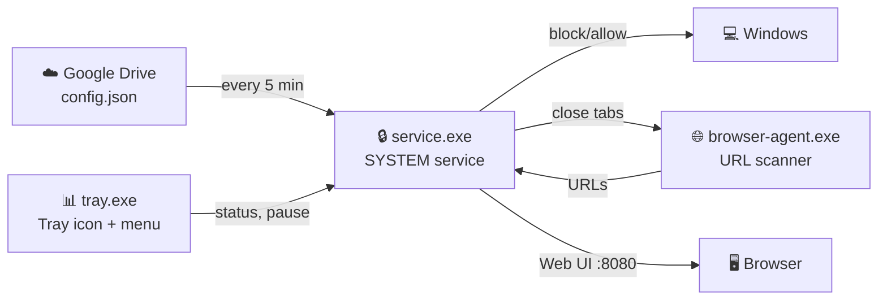
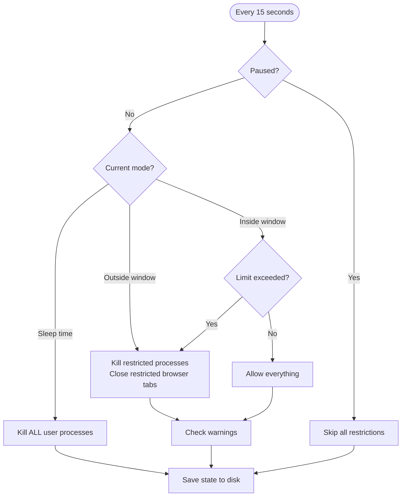

# Parental Control Service

[](LICENSE)

> 🇷🇺 [Документация на русском](README_RU.md)

Open-source Windows service for parental control: app/site blocking, entertainment scheduling, sleep time enforcement, and web-based management UI.

## Architecture



## Three Processes

| Process | Runs as | Purpose |
|---------|---------|---------|
| `service.exe` | SYSTEM (Session 0) | Core logic: scheduling, blocking, config, HTTP API |
| `browser-agent.exe` | User session | Reads browser URLs via UI Automation, sends to service, closes blocked windows |
| `tray.exe` | User session | System tray icon, status, pause/password/config management |

## Requirements

- Windows 10/11
- Go 1.21+
- Administrator rights (for installation)

## Build

```powershell
powershell -File build.ps1
```

Produces: `service.exe`, `tray.exe`, `browser-agent.exe`, `installer.exe` with embedded git commit version.

## Installation

### GUI Mode

Run `installer.exe` without arguments. A dialog appears with fields for Config URL, Password, and buttons Install / Uninstall / Cancel. UAC elevation is requested automatically.

### Silent Mode

```powershell
.\installer.exe --silent --config-url "URL" --password "PWD" install
```

### Quick Reinstall

```powershell
powershell -File reinstall.ps1
```

### What the installer does

1. Downloads and validates `config.json` from the provided URL
2. Creates data directory `C:\ProgramData\ParentalControlService\`
3. Creates install directory `C:\Program Files\ParentalControlService\`
4. Applies protected ACL (SYSTEM: full, Users: read-only)
5. Registers Windows service with auto-start and recovery actions
6. Adds firewall rule for HTTP port (LAN access)
7. Registers tray and browser-agent in autostart (HKLM Run)
8. Starts the service
9. Launches tray.exe and browser-agent.exe in the user session

## Uninstall

```powershell
.\installer.exe uninstall              # keep data
.\installer.exe --clean uninstall      # remove everything
```

Or click "Удалить" in the GUI installer.

## Configuration

The service loads `config.json` from a remote URL every 5 minutes. The URL is set during installation and can be changed via the admin web page or tray menu.

### config.json structure

```json
{
  "allowed_apps": {
    "apps": [
      { "name": "VS Code", "executable": "code.exe" },
      { "name": "Word", "executable": "winword.exe", "path": "C:\\Program Files\\Microsoft Office\\*" }
    ]
  },
  "allowed_sites": {
    "sites": [
      { "domain": "wikipedia.org", "include_subdomains": true },
      { "domain": "youtube.com", "include_subdomains": true, "allowed_paths": ["/edu"] },
      { "domain": "docs.google.com", "include_subdomains": false },
      { "domain": "127.0.0.1", "include_subdomains": false }
    ]
  },
  "schedule": {
    "entertainment_windows": [
      { "days": ["saturday"], "start": "10:00", "end": "22:00", "limit_minutes": 120 }
    ],
    "sleep_times": [
      { "days": ["monday","tuesday","wednesday","thursday"], "start": "22:00", "end": "07:00" }
    ],
    "warning_before_minutes": 10,
    "sleep_warning_before_minutes": 15,
    "full_logging": true,
    "entertainment_apps": ["vlc.exe", "mpc-hc64.exe"]
  }
}
```

### Key fields

| Field | Description |
|-------|-------------|
| `allowed_apps.apps[].executable` | Process name (e.g. `code.exe`) |
| `allowed_apps.apps[].path` | Optional path pattern with wildcards |
| `allowed_sites.sites[].domain` | Domain name |
| `allowed_sites.sites[].include_subdomains` | Allow all subdomains |
| `allowed_sites.sites[].allowed_paths` | If set, only these URL path prefixes are allowed |
| `entertainment_windows` | Time windows when entertainment is allowed with minute limits |
| `sleep_times` | Sleep periods — ALL apps are blocked |
| `warning_before_minutes` | Warning N min before entertainment ends |
| `sleep_warning_before_minutes` | Warning N min before sleep starts |
| `full_logging` | Enable detailed logging to file |
| `entertainment_apps` | Apps counted as entertainment (video players etc.) |

### URL matching rules

- `include_subdomains: true` — matches domain and all subdomains
- `include_subdomains: false` — exact domain match only
- `allowed_paths` — only URLs starting with these prefixes are allowed
- Specific subdomain entries (e.g. `drive.google.com`) are NOT blocked by parent domain path restrictions
- Add `127.0.0.1` to allowed sites for web UI access

## How it works



### Browser monitoring

`browser-agent.exe` runs independently:
- Scans browser windows every 10 seconds via Windows UI Automation COM API
- Reads the actual URL from the address bar (Chrome, Edge)
- Sends URLs to service via `POST /browser-activity`
- Receives list of window handles to close
- Shows warning notification → waits 30 seconds → closes window via `WM_CLOSE`

### Fail-closed behavior

If configuration is unavailable, the service blocks everything except system processes. Retries every 30 seconds.

## Web UI

Available at `http://127.0.0.1:8080/` and from LAN. All pages support `?lang=ru` / `?lang=en`.

| Page | URL | Description |
|------|-----|-------------|
| Dashboard | `/` | Status and navigation |
| Logs | `/logs-html` | Event log with date/type filters, auto-refresh |
| Statistics | `/stats-html` | Usage time by apps and sites |
| Configuration | `/config-html` | Allowed apps, sites, schedule |
| Admin | `/admin-html` | Pause, change password, change config URL |

### REST API

| Endpoint | Method | Description |
|----------|--------|-------------|
| `/status` | GET | Current service status |
| `/logs` | GET | Recent log entries |
| `/config` | GET | Current configuration |
| `/stats?date=YYYY-MM-DD` | GET | Day statistics |
| `/pause` | POST | Set pause `{password, minutes}` |
| `/unpause` | POST | Remove pause `{password}` |
| `/reload-config` | POST | Force config reload |
| `/change-password` | POST | `{old_password, new_password}` |
| `/change-config-url` | POST | `{password, url}` |
| `/browser-activity` | POST | Browser URL report (used by browser-agent) |

## Tray Application

| Menu item | Description |
|-----------|-------------|
| Show Status | Current mode, time spent/remaining |
| Pause / Unpause | Pause restrictions (requires password) |
| Change Password | Change management password |
| Reload Config | Force config reload |
| Configuration | Open config page in browser |
| Open Logs | Open logs page in browser |
| Statistics | Open statistics page |
| Switch language | Toggle EN ↔ RU |
| Quit | Exit tray (does NOT stop the service) |

Tray icon changes when paused. Language preference persists in `lang.txt`.

## File Locations

| Path | Contents |
|------|----------|
| `C:\Program Files\ParentalControlService\` | Binaries |
| `C:\ProgramData\ParentalControlService\settings.json` | Config URL, password hash, HTTP port |
| `...\state.json` | Entertainment counter, last tick |
| `...\lang.txt` | Language preference |
| `...\config\config.json` | Cached remote config |
| `...\logs\full.log` | Detailed log |
| `...\stats\` | Daily usage statistics |

## Security

- Service runs as SYSTEM — cannot be stopped by child user
- Data directory: SYSTEM full access, Users read-only
- Password stored as bcrypt hash
- Web UI restricted to LAN addresses only
- Firewall rule: `remoteip=localsubnet`

## Tests

```powershell
go test ./...
```

Property-based tests using `pgregory.net/rapid` cover process classification, URL matching, scheduler logic, state persistence, enforcer decisions, config management, HTTP server, and logging.

## Troubleshooting

| Problem | Solution |
|---------|----------|
| Service won't start | `Get-EventLog -LogName Application -Source ParentalControlService -Newest 10` |
| Config not loading | Verify URL: `curl "CONFIG_URL"` |
| Tray shows "unavailable" | `Get-Service ParentalControlService` |
| Browser tabs not closing | Check browser-agent.exe in Task Manager |
| Web UI not from LAN | `netsh advfirewall firewall show rule name="ParentalControlService HTTP"` |
| Password forgotten | Reinstall with `--clean` and set new password |

## License

This project is open source and available under the [Apache License 2.0](LICENSE).

Copyright 2020 Viktar Mikalayeu
