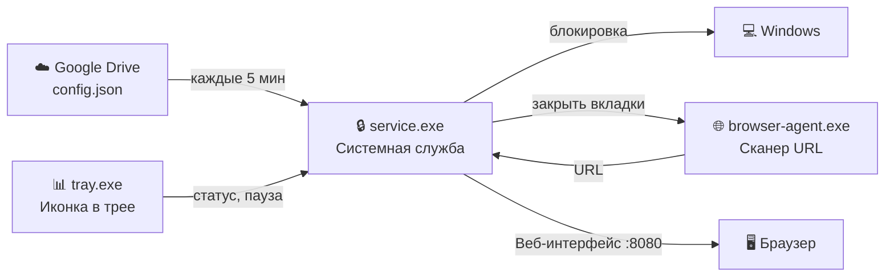
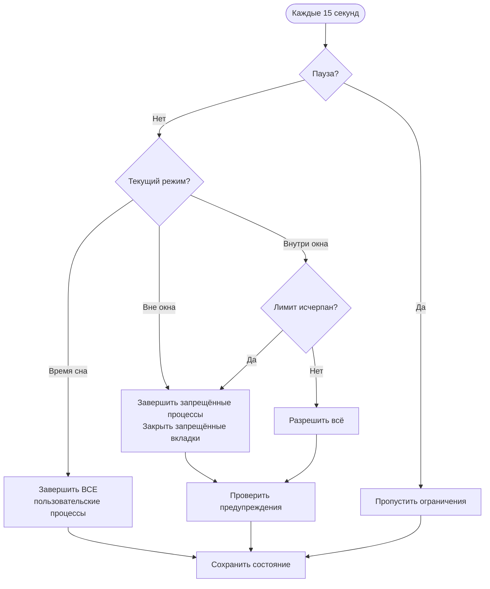

# Сервис родительского контроля

[](LICENSE)

> 🇬🇧 [English documentation](README.md)

Открытый (open-source) сервис родительского контроля для Windows: блокировка программ и сайтов, расписание развлечений, режим сна, веб-интерфейс управления.

## Архитектура



## Три процесса

| Процесс | Запуск от | Назначение |
|---------|-----------|------------|
| `service.exe` | SYSTEM (Сессия 0) | Основная логика: расписание, блокировка, конфиг, HTTP API |
| `browser-agent.exe` | Сессия пользователя | Читает URL из адресной строки браузера через UI Automation, отправляет сервису, закрывает заблокированные окна |
| `tray.exe` | Сессия пользователя | Иконка в трее, статус, пауза, смена пароля, управление конфигом |

## Требования

- Windows 10/11
- Go 1.21+
- Права администратора (для установки)

## Сборка

```powershell
powershell -File build.ps1
```

Создаёт: `service.exe`, `tray.exe`, `browser-agent.exe`, `installer.exe` с встроенным хешем git-коммита.

## Установка

### Графический режим (GUI)

Запустите `installer.exe` без аргументов. Откроется диалоговое окно с полями:
- URL конфигурации (Google Drive или GitHub)
- Пароль для управления
- Подтверждение пароля
- Кнопки: Установить / Удалить / Отмена

UAC-повышение запрашивается автоматически.

### Тихая установка (Silent)

```powershell
.\installer.exe --silent --config-url "URL" --password "ПАРОЛЬ" install
```

### Быстрая переустановка

```powershell
powershell -File reinstall.ps1
```

### Что делает установщик

1. Скачивает и проверяет `config.json` по указанному URL
2. Создаёт директорию данных `C:\ProgramData\ParentalControlService\`
3. Создаёт директорию программ `C:\Program Files\ParentalControlService\`
4. Устанавливает защитный ACL (SYSTEM: полный доступ, Users: только чтение)
5. Регистрирует Windows-службу с автозапуском и автовосстановлением
6. Добавляет правило файрвола для HTTP-порта (доступ из LAN)
7. Регистрирует tray и browser-agent в автозапуске (HKLM Run)
8. Запускает службу
9. Запускает tray.exe и browser-agent.exe в сессии пользователя

## Удаление

```powershell
.\installer.exe uninstall              # данные сохраняются
.\installer.exe --clean uninstall      # удалить всё
```

Или нажмите «Удалить» в GUI-инсталляторе.

## Конфигурация

Сервис загружает `config.json` с удалённого URL каждые 5 минут. URL задаётся при установке и может быть изменён через веб-страницу управления или меню трея.

### Структура config.json

```json
{
  "allowed_apps": {
    "apps": [
      { "name": "VS Code", "executable": "code.exe" },
      { "name": "Word", "executable": "winword.exe", "path": "C:\\Program Files\\Microsoft Office\\*" }
    ]
  },
  "allowed_sites": {
    "sites": [
      { "domain": "wikipedia.org", "include_subdomains": true },
      { "domain": "youtube.com", "include_subdomains": true, "allowed_paths": ["/edu"] },
      { "domain": "docs.google.com", "include_subdomains": false },
      { "domain": "127.0.0.1", "include_subdomains": false }
    ]
  },
  "schedule": {
    "entertainment_windows": [
      { "days": ["saturday"], "start": "10:00", "end": "22:00", "limit_minutes": 120 }
    ],
    "sleep_times": [
      { "days": ["monday","tuesday","wednesday","thursday"], "start": "22:00", "end": "07:00" }
    ],
    "warning_before_minutes": 10,
    "sleep_warning_before_minutes": 15,
    "full_logging": true,
    "entertainment_apps": ["vlc.exe", "mpc-hc64.exe"]
  }
}
```

### Основные поля

| Поле | Описание |
|------|----------|
| `allowed_apps.apps[].executable` | Имя процесса (например `code.exe`) |
| `allowed_apps.apps[].path` | Опциональный путь с маской (`*`) |
| `allowed_sites.sites[].domain` | Доменное имя |
| `allowed_sites.sites[].include_subdomains` | Разрешить все поддомены |
| `allowed_sites.sites[].allowed_paths` | Если указано — разрешены только эти префиксы путей URL |
| `entertainment_windows` | Временные окна для развлечений с лимитом в минутах |
| `sleep_times` | Время сна — ВСЕ программы блокируются |
| `warning_before_minutes` | Предупреждение за N мин до конца развлечений |
| `sleep_warning_before_minutes` | Предупреждение за N мин до начала сна |
| `full_logging` | Подробное логирование в файл |
| `entertainment_apps` | Приложения-развлечения (видеоплееры и т.д.) |

### Правила сопоставления URL

- `include_subdomains: true` — совпадает домен и все поддомены
- `include_subdomains: false` — только точное совпадение домена
- `allowed_paths` — разрешены только URL, начинающиеся с указанных префиксов
- Записи для конкретных поддоменов (например `drive.google.com`) НЕ блокируются ограничениями родительского домена
- Добавьте `127.0.0.1` в разрешённые сайты для доступа к веб-интерфейсу

## Как это работает



### Мониторинг браузеров

`browser-agent.exe` работает независимо:
- Сканирует окна браузеров каждые 10 секунд через Windows UI Automation COM API
- Читает реальный URL из адресной строки (Chrome, Edge)
- Отправляет URL сервису через `POST /browser-activity`
- Получает список окон для закрытия
- Показывает предупреждение → ждёт 30 секунд → закрывает окно через `WM_CLOSE`

### Поведение без конфига (fail-closed)

Если конфигурация недоступна (нет интернета, неверный URL), сервис блокирует всё кроме системных процессов. Повторяет попытку каждые 30 секунд.

## Веб-интерфейс

Доступен по адресу `http://127.0.0.1:8080/` и из локальной сети. Все страницы поддерживают `?lang=ru` / `?lang=en`.

| Страница | URL | Описание |
|----------|-----|----------|
| Главная | `/` | Статус и навигация |
| Логи | `/logs-html` | Журнал событий с фильтрами по дате/типу, авто-обновление |
| Статистика | `/stats-html` | Время использования по приложениям и сайтам |
| Конфигурация | `/config-html` | Разрешённые программы, сайты, расписание |
| Управление | `/admin-html` | Пауза, смена пароля, изменение URL конфига |

### REST API

| Эндпоинт | Метод | Описание |
|----------|-------|----------|
| `/status` | GET | Текущий статус сервиса |
| `/logs` | GET | Последние записи лога |
| `/config` | GET | Текущая конфигурация |
| `/stats?date=ГГГГ-ММ-ДД` | GET | Статистика за день |
| `/pause` | POST | Поставить паузу `{password, minutes}` |
| `/unpause` | POST | Снять паузу `{password}` |
| `/reload-config` | POST | Принудительно обновить конфиг |
| `/change-password` | POST | Сменить пароль `{old_password, new_password}` |
| `/change-config-url` | POST | Изменить URL конфига `{password, url}` |
| `/browser-activity` | POST | Отчёт о URL браузеров (используется browser-agent) |

## Трей-приложение

| Пункт меню | Описание |
|------------|----------|
| Показать статус | Текущий режим, потрачено/осталось минут |
| Пауза / Снять паузу | Приостановить ограничения (нужен пароль) |
| Сменить пароль | Изменить пароль управления |
| Обновить конфиг | Принудительно загрузить конфиг |
| Конфигурация | Открыть страницу конфига в браузере |
| Открыть логи | Открыть страницу логов |
| Статистика | Открыть страницу статистики |
| Переключить язык | EN ↔ RU |
| Выход | Закрыть трей (НЕ останавливает сервис) |

Иконка в трее меняется при паузе (красная полоса). Выбор языка сохраняется в `lang.txt`.

## Расположение файлов

| Путь | Содержимое |
|------|------------|
| `C:\Program Files\ParentalControlService\` | Исполняемые файлы |
| `C:\ProgramData\ParentalControlService\settings.json` | URL конфига, хеш пароля, HTTP-порт |
| `...\state.json` | Счётчик развлечений, время последнего тика |
| `...\lang.txt` | Выбранный язык |
| `...\config\config.json` | Кешированная конфигурация |
| `...\logs\full.log` | Подробный лог |
| `...\stats\` | Ежедневная статистика использования |

## Безопасность

- Сервис работает от SYSTEM — ребёнок не может его остановить
- Директория данных: SYSTEM — полный доступ, Users — только чтение
- Пароль хранится как bcrypt-хеш
- Веб-интерфейс доступен только из локальной сети
- Правило файрвола: `remoteip=localsubnet`

## Тесты

```powershell
go test ./...
```

Property-based тесты на `pgregory.net/rapid` покрывают: классификацию процессов, сопоставление URL, логику планировщика, сохранение состояния, решения блокировщика, управление конфигом, HTTP-сервер и логирование.

## Устранение неполадок

| Проблема | Решение |
|----------|---------|
| Сервис не запускается | `Get-EventLog -LogName Application -Source ParentalControlService -Newest 10` |
| Конфиг не загружается | Проверьте URL: `curl "URL_КОНФИГА"` |
| Трей показывает «недоступен» | `Get-Service ParentalControlService` |
| Вкладки браузера не закрываются | Проверьте browser-agent.exe в Диспетчере задач |
| Веб-интерфейс не доступен из LAN | `netsh advfirewall firewall show rule name="ParentalControlService HTTP"` |
| Забыт пароль | Переустановите с `--clean` и задайте новый пароль |

## Лицензия

Этот проект является открытым (open-source) и распространяется под лицензией [Apache License 2.0](LICENSE).

Copyright 2020 Viktar Mikalayeu
